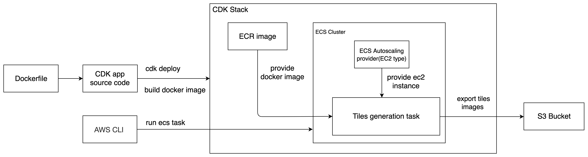

# Tiles generation pipeline with CDK

 This project in `tilesGenerationPipeline` folder helps to build a raster map tiles generaion pipeline on Amazon ECS in AWS CDK. The docker base image is come from https://github.com/Overv/openstreetmap-tile-server.

## Diagram
.

#  Getting Started
## Prerequisites

### Install Node.js
Visit [here](https://nodejs.org/en/) to install Node.js

### Install AWS CDK Toolkit
```
npm install -g aws-cdk
```

### Install AWS CLI
Visit [here](https://docs.aws.amazon.com/cli/latest/userguide/getting-started-install.html) to install AWS CLI
### AWS Prerequisites
Visit [here](https://docs.aws.amazon.com/cdk/latest/guide/getting_started.html#getting_started_prerequisites) to configure aws credentials. 
## Deployment

### Deploy steps

1. (Optional)The tiles generation configuration could be customized at `cdk.ts`. For example, Users can customize tiles generation area, zoom level, schedule generation, etc.


2. A S3 bucket is required in CDK deployment to store generated tiles. The context name `TILE_S3_BUCKET` you will use to deploy. This bucket must be in the same aws account.

3. Deploy CDK stacks, all AWS resources defined within the scope of a stack

* Test tile generation stack, it's used to test with light data for development and tuning performance.
```
cdk deploy TestTileGenerationStack --context TILE_S3_BUCKET=S3BucketName
```

* Planet tile generation stack
```
cdk deploy PlanetTileGenerationStack --context TILE_S3_BUCKET=S3BucketName
```

4. Execute tiles generation. Once stack deployed, you will get the outputs of `ClusterName`, `TaskDefinitionName`, `CapacityProviderName` on the terminal end. Use them on the below command.

```
aws ecs run-task --cluster ClusterName --task-definition TaskDefinitionName --capacity-provider-strategy capacityProvider=CapacityProviderName
```

5. Check result. On AWS management console, you can check ECS task logs, after ECS test task exited with 0, the maps tiles will be uploaded to S3 bucket.

## Useful commands

 * `npm run build`   compile typescript to js
 * `npm run watch`   watch for changes and compile
 * `cdk deploy`      deploy this stack to your default AWS account/region
 * `cdk destroy`     destroy the stack
 * `cdk diff`        compare deployed stack with current state
 * `cdk synth`       emits the synthesized CloudFormation template
